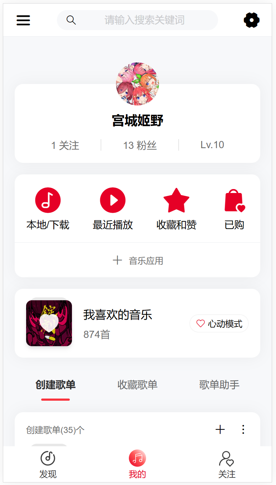
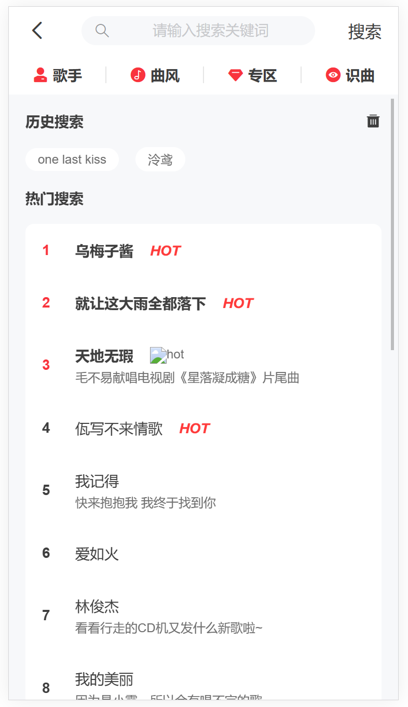

# Vue3 + Vant4 网易云移动端

高仿移动端网易云音乐

## 项目预览

http://miyagi-jiye.gitee.io/net-ease-cloud-music

## 更新日志

- 2 月 3 日：修复单曲搜索失效的问题。

- 2 月 15 日：修改个人详情页，修复 IP 地址 tag 显示问题。

- 4 月 29 日：服务器过期，修复网易云接口失效的问题，新增可输入自己的网易云接口地址，哔哩哔哩接口和bangumi接口失效。

## 项目截图

<div style="display:grid;grid-template-columns:repeat(auto-fit,minmax(180px,1fr));gap:16px;">
  
  
  
  
  
  
</div>

## 待办事项

- [x] 重构项目
- [ ] 优化项目

## 使用方式

1. `下载 Zip压缩包`：[点击下载](https://gitee.com/miyagi-jiye/net-ease-cloud-music/repository/archive/master.zip) or 克隆项目到本地

2. 解压到本地

3. 进入项目目录，安装依赖

   ```sh
   npm install
   ```

4. 运行项目

   ```sh
   npm run dev
   ```

5. 浏览器访问

   ```sh
   http://localhost:5173/
   ```

6. 打包项目
   ```sh
   npm run build
   ```
